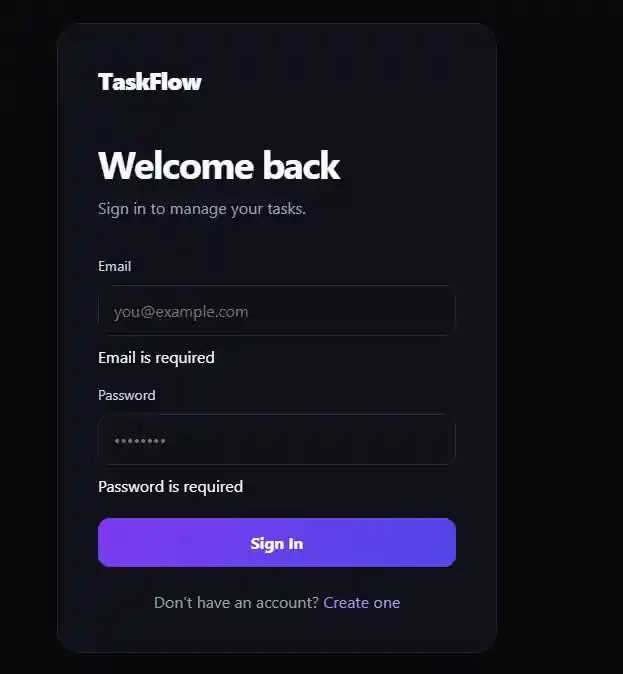
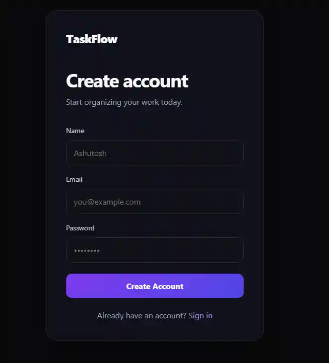
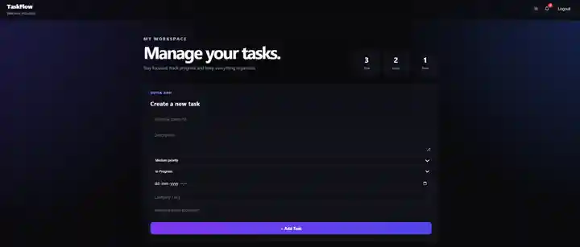
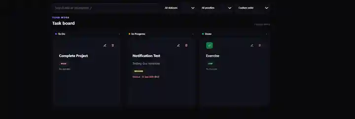
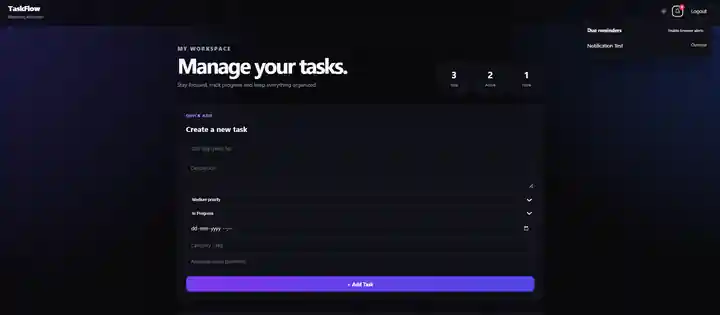

# 🚀 TaskFlow — Full-Stack Task Manager

TaskFlow is a production-style full-stack task management application built with **React + TypeScript, Spring Boot, PostgreSQL, JWT, Flyway, WebSocket, Tailwind CSS, and Docker**.

It supports secure authentication, refresh-token sessions, user-specific and collaborative tasks, CRUD workflows, Kanban drag-and-drop, search/filter/sort, due reminders, offline caching, real-time updates, role-based authorization, API documentation, testing, and responsive dark/light UI.

## 🌐 Live Demo

**Frontend:** https://week8-fullstack-task-manager.onrender.com

**Backend API:** https://taskflow-backend-3j3q.onrender.com

**API Docs:** https://taskflow-backend-3j3q.onrender.com/swagger-ui.html

**Project Documentation:** [docs/PROJECT_DOCUMENTATION.md](docs/PROJECT_DOCUMENTATION.md)

> Production is deployed with Render + Neon PostgreSQL. The repository also includes a Docker Compose stack for local development.

---

## ✨ Features

### 🔐 Authentication & Security
- User registration and login
- JWT access tokens
- Rotating refresh tokens with logout/revocation
- BCrypt password hashing
- Stateless Spring Security
- Role-based authorization with USER / ADMIN roles
- Authentication rate limiting
- Request validation and global error handling
- Correlation IDs for request tracing
- CORS configuration
- JPA-backed queries to avoid SQL string concatenation
- React output escaping for XSS-safe rendering

### ✅ Task Management
- Create, read, update, and delete tasks
- Task status: To Do / In Progress / Done
- Priority: High / Medium / Low
- Due dates and in-app due reminders
- Categories/tags
- Collaborative assignment by email
- Search by title or description
- Status and priority filters
- Sorting by custom position, due date, priority, creation time, or title
- Kanban drag-and-drop between status columns
- Optimistic UI updates for task actions
- User-specific ownership with assignee access

### ⚡ Real-Time & Offline UX
- Native WebSocket endpoint at `/ws/tasks`
- Task change broadcasts trigger live task refreshes
- Offline mode with cached task data
- Online/offline connection indicator
- PWA manifest and service worker
- Browser notification permission support
- Keyboard shortcuts: `N` for new task, `/` for search, `Esc` to close reminders

### 🎨 Frontend
- React + TypeScript
- React Router
- React Context API
- React Hook Form validation
- Tailwind CSS utility layer + custom responsive styling
- Error boundary and loading/error states
- Dark/light theme
- Responsive Kanban board
- Accessible labels, titles, and keyboard-friendly interactions

### 🗄️ Backend & Database
- Spring Boot REST API
- Spring Security
- Spring Data JPA
- PostgreSQL
- Flyway migrations
- Refresh-token persistence
- Spring WebSocket
- OpenAPI / Swagger UI
- Actuator health endpoint
- Correlation ID logging

### 🐳 Deployment & DevOps
- Multi-stage backend Docker build
- Frontend Docker/Nginx build
- Docker Compose local stack
- Render production deployment
- Neon PostgreSQL production database
- Environment-variable based production configuration
- GitHub Actions CI for backend and frontend

---

## 🛠️ Tech Stack

### Frontend
- React 19
- TypeScript
- Vite
- React Router
- React Hook Form
- Tailwind CSS
- Native WebSocket API

### Backend
- Java 21
- Spring Boot 4.1.1
- Spring Security
- Spring Data JPA
- Bean Validation
- JJWT
- Spring WebSocket
- Springdoc OpenAPI

### Database & Infrastructure
- PostgreSQL
- Flyway
- Docker
- Nginx
- Render
- Neon PostgreSQL

### Testing
- JUnit / Spring Boot Test
- Vitest
- React Testing Library
- GitHub Actions CI

---

## 🏗️ Architecture

```text
React + TypeScript
      |
      | REST + JWT
      | WebSocket
      v
Spring Boot API
  |      |      |
  |      |      +--> Spring Security / JWT / Refresh Tokens
  |      +---------> WebSocket / Real-time Events
  v
Service Layer
  |
Repository Layer
  |
PostgreSQL + Flyway
```

---

## 🔑 Authentication Flow

```text
Register / Login
       |
       +--> BCrypt password verification
       |
       +--> Access JWT
       |
       +--> Refresh Token
              |
              v
       React local session
              |
              +--> 401 response
                      |
                      +--> POST /api/auth/refresh
                              |
                              +--> New Access + Refresh Token
```

---

## 🔌 REST API

### Authentication
| Method | Endpoint | Description |
|---|---|---|
| POST | `/api/auth/register` | Register a user |
| POST | `/api/auth/login` | Login and issue access + refresh tokens |
| POST | `/api/auth/refresh` | Rotate refresh token and issue new tokens |
| POST | `/api/auth/logout` | Revoke refresh token |

### Tasks
| Method | Endpoint | Description |
|---|---|---|
| GET | `/api/tasks` | List accessible tasks with search/filter/sort |
| GET | `/api/tasks/{id}` | Get one accessible task |
| POST | `/api/tasks` | Create task |
| PUT | `/api/tasks/{id}` | Update task, status, priority, due date, order, or assignment |
| DELETE | `/api/tasks/{id}` | Delete task |

### Admin
| Method | Endpoint | Access |
|---|---|---|
| GET | `/api/admin/users` | ADMIN role |

### WebSocket
- `ws://localhost:8080/ws/tasks`
- Production: `wss://taskflow-backend-3j3q.onrender.com/ws/tasks`

---

## 🗃️ Database Migrations

- **V1** — Initial `tasks` table
- **V2** — `users` table
- **V3** — Link tasks to users
- **V4** — Task status, priority, due date, position, category, assignee
- **V5** — Refresh token storage
- **V6** — User roles

---

## 📁 Project Structure

```text
week8-fullstack-task-manager/
├── backend/
│   ├── src/main/java/com/ashutosh/taskmanager/
│   │   ├── config/
│   │   ├── controller/
│   │   ├── dto/
│   │   ├── entity/
│   │   ├── exception/
│   │   ├── repository/
│   │   ├── security/
│   │   └── service/
│   ├── src/main/resources/
│   │   ├── db/migration/
│   │   └── application-example.properties
│   ├── Dockerfile
│   └── pom.xml
├── frontend/
│   ├── src/
│   │   ├── components/
│   │   ├── context/
│   │   ├── pages/
│   │   ├── services/
│   │   ├── App.tsx
│   │   ├── App.test.tsx
│   │   ├── main.tsx
│   │   └── types.ts
│   ├── public/
│   ├── Dockerfile
│   ├── nginx.conf
│   ├── package.json
│   ├── tsconfig.json
│   └── vitest.config.ts
├── docs/
│   ├── PROJECT_DOCUMENTATION.md
│   └── screenshots/
├── .github/workflows/ci.yml
├── docker-compose.yml
└── README.md
```

---

## 🚀 Local Development

### Option 1 — Docker Compose

```bash
docker compose up --build
```

Frontend: http://localhost:5173  
Backend: http://localhost:8080  
Swagger UI: http://localhost:8080/swagger-ui.html

### Option 2 — Manual

Backend:

```bash
cd backend
mvn spring-boot:run
```

Frontend:

```bash
cd frontend
npm install
npm run dev
```

Create `backend/src/main/resources/application.properties` from `application-example.properties` and provide your own local database credentials and JWT secret.

---

## 🧪 Testing

Backend:

```bash
cd backend
mvn clean test
```

Backend coverage includes JUnit/Mockito unit tests, Spring Boot integration/security tests, RestAssured API tests, and Testcontainers PostgreSQL migration tests.

Frontend:

```bash
cd frontend
npm install
npm run typecheck
npm test
npm run build
npm run test:e2e
```

Frontend coverage includes Vitest + React Testing Library, MSW API mocks, axe-core accessibility checks, and Cypress browser E2E tests.

GitHub Actions runs backend tests plus frontend lint, typecheck, tests, build, and Cypress E2E tests on pushes and pull requests to `main`.

---

## ☁️ Production Deployment

- **Frontend:** Render Static Site
- **Backend:** Render Docker Web Service
- **Database:** Neon PostgreSQL
- **Frontend API configuration:** `VITE_API_URL`
- **SPA rewrite:** Render `/* → /index.html`
- **WebSocket:** `/ws/tasks`
- **Health:** Spring Boot Actuator `/actuator/health`
- **API docs:** Swagger UI via springdoc

---

## 🔒 Security Notes

Never commit:
- database passwords
- JWT secrets
- refresh tokens
- local `application.properties`

Production configuration is supplied through environment variables.

---

## 📸 Screenshots

### Login


### Registration


### Dashboard


### Task Board


### Notifications


## 👨‍💻 Author

**Ashutosh Panwar**

GitHub: https://github.com/Ashutosh9-pan

## 📄 License

This project was created for learning and development purposes.
