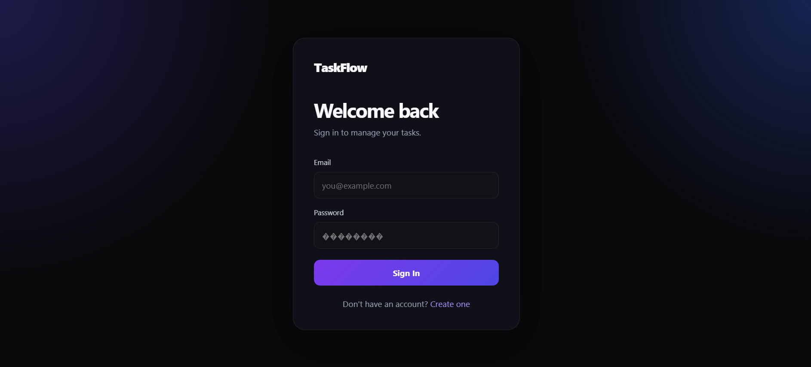
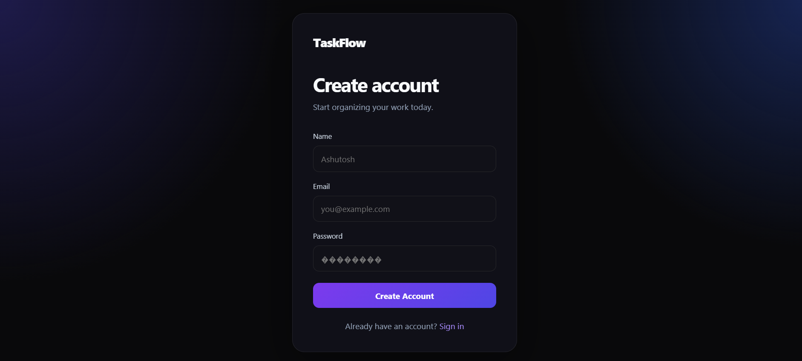
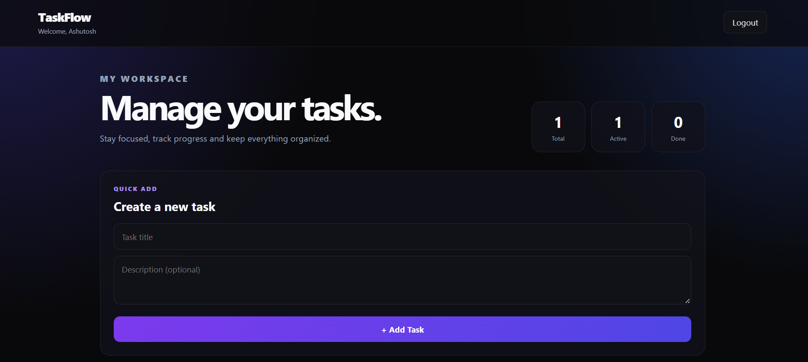
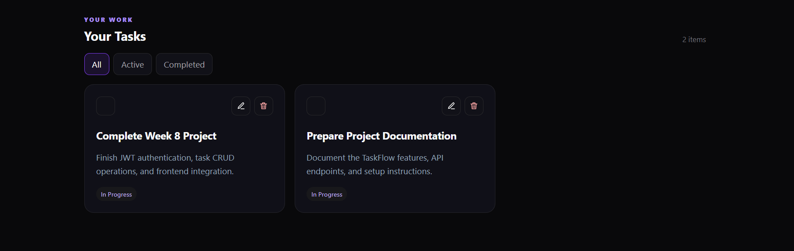
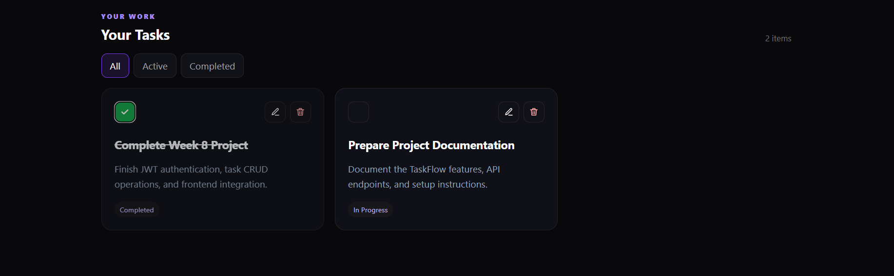
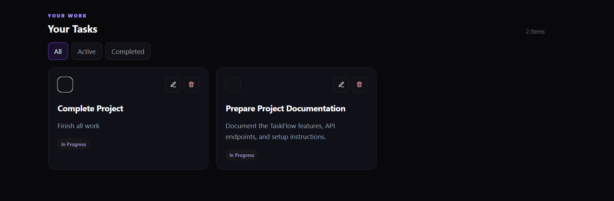
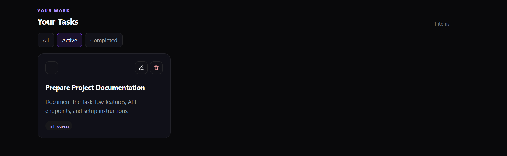
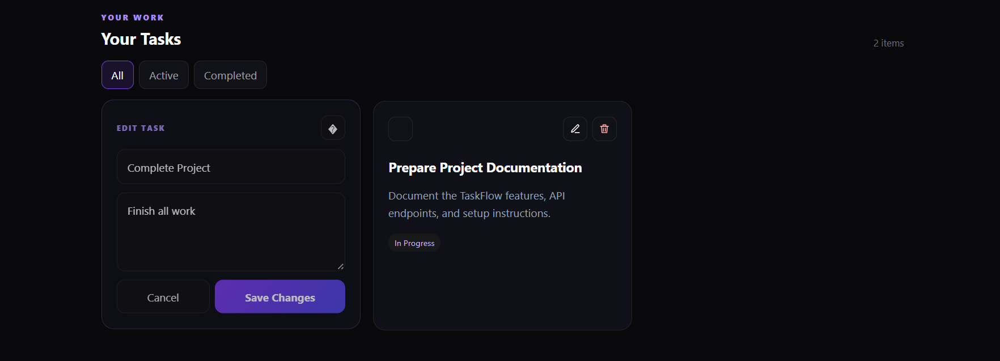

# 🚀 TaskFlow — Full-Stack Task Manager

TaskFlow is a modern full-stack task management application built with **React, Spring Boot, PostgreSQL, JWT authentication, and Flyway**.

It provides secure user authentication, user-specific task management, complete CRUD functionality, task filtering, task completion, and a responsive dark-themed dashboard.

---

## ✨ Features

### 🔐 Authentication

- User registration
- User login
- JWT-based authentication
- BCrypt password hashing
- Protected task APIs
- Stateless Spring Security configuration

### ✅ Task Management

- Create tasks
- View tasks
- Edit tasks
- Delete tasks
- Mark tasks as completed
- Active and completed task states
- All / Active / Completed filters
- User-specific task isolation

### 🎨 Frontend

- Modern dark-themed UI
- Responsive dashboard
- React Router navigation
- Interactive task cards
- Edit and delete actions
- Task completion toggle
- Live UI updates after CRUD operations

### 🗄️ Backend & Database

- RESTful Spring Boot APIs
- Spring Security integration
- JWT authentication
- Spring Data JPA
- PostgreSQL persistence
- Flyway database migrations
- User-to-task relationship

---

## 🛠️ Tech Stack

### Frontend

- React
- Vite
- React Router
- JavaScript
- CSS

### Backend

- Java 21
- Spring Boot 4.1.1
- Spring Web
- Spring Security
- Spring Data JPA
- Bean Validation
- JJWT

### Database

- PostgreSQL
- Flyway

---

## 🏗️ Architecture

~~~~text
                    React Frontend
                    Vite + React
                         |
                         | HTTP / REST
                         | JWT Bearer Token
                         v
                 Spring Boot Backend
                         |
              +----------+----------+
              |                     |
         Controllers             Security
              |                     |
              v                     v
          Services             JWT Filter
              |
              v
         Repositories
              |
              v
          PostgreSQL
~~~~

---

## 🔑 Authentication Flow

~~~~text
User
 |
 +--> Register
 |       |
 |       +--> BCrypt Password Hash
 |       |
 |       +--> Save User
 |       |
 |       +--> Generate JWT
 |
 +--> Login
         |
         +--> Validate Credentials
         |
         +--> Generate JWT
                 |
                 v
             React Client
                 |
                 v
       Authorization: Bearer <JWT>
                 |
                 v
          Protected Task APIs
~~~~

---

## 👤 User-Specific Task Flow

Each authenticated user can access only the tasks associated with their account.

~~~~text
JWT Token
    |
    v
Authenticated User
    |
    v
Extract Email
    |
    v
Find User
    |
    v
Task Repository
    |
    v
Only That User's Tasks
~~~~

---

## 🔌 REST API

### Authentication Endpoints

| Method | Endpoint | Description |
|---|---|---|
| POST | `/api/auth/register` | Register a new user |
| POST | `/api/auth/login` | Login and receive JWT |

### Task Endpoints

| Method | Endpoint | Authentication |
|---|---|---|
| GET | `/api/tasks` | JWT Required |
| GET | `/api/tasks/{id}` | JWT Required |
| POST | `/api/tasks` | JWT Required |
| PUT | `/api/tasks/{id}` | JWT Required |
| DELETE | `/api/tasks/{id}` | JWT Required |

---

## 🗃️ Database Migrations

### V1 — Initial Tasks

`V1__init.sql`

Creates the initial `tasks` table.

### V2 — Users

`V2__create_users.sql`

Creates the `users` table for authentication.

### V3 — User Task Relationship

`V3__link_tasks_to_users.sql`

Adds the relationship between tasks and users using `user_id`.

---

## 📁 Project Structure

~~~~text
week8-fullstack-task-manager/
│
├── backend/
│   ├── src/
│   │   ├── main/
│   │   │   ├── java/com/ashutosh/taskmanager/
│   │   │   │   ├── config/
│   │   │   │   ├── controller/
│   │   │   │   ├── dto/
│   │   │   │   ├── entity/
│   │   │   │   ├── repository/
│   │   │   │   ├── security/
│   │   │   │   └── service/
│   │   │   │
│   │   │   └── resources/
│   │   │       ├── db/migration/
│   │   │       └── application-example.properties
│   │   │
│   │   └── test/
│   │
│   ├── pom.xml
│   ├── mvnw
│   └── mvnw.cmd
│
├── frontend/
│   ├── src/
│   │   ├── pages/
│   │   ├── services/
│   │   ├── App.jsx
│   │   ├── App.css
│   │   ├── index.css
│   │   └── main.jsx
│   │
│   ├── public/
│   ├── package.json
│   ├── package-lock.json
│   └── vite.config.js
│
├── docs/
│   └── screenshots/
│       ├── 01-login.png
│       ├── 02-register.png
│       ├── 03-dashboard.png
│       ├── 04-all-tasks.png
│       ├── 05-completed-task.png
│       ├── 06-task-actions.png
│       ├── 07-active-filter.png
│       └── 08-edit-task.png
│
├── .gitignore
└── README.md
~~~~

---

## 🚀 Getting Started

### 1. Clone the Repository

~~~~bash
git clone https://github.com/Ashutosh9-pan/week8-fullstack-task-manager.git
cd week8-fullstack-task-manager
~~~~

---

## ⚙️ Backend Setup

Navigate to the backend:

~~~~bash
cd backend
~~~~

Create your local configuration file:

`src/main/resources/application.properties`

Use `application-example.properties` as the template and provide your own PostgreSQL credentials and JWT secret.

Run the backend:

~~~~bash
mvn spring-boot:run
~~~~

Backend:

`http://localhost:8080`

---

## 💻 Frontend Setup

Open another terminal:

~~~~bash
cd frontend
~~~~

Install dependencies:

~~~~bash
npm install
~~~~

Start the frontend:

~~~~bash
npm run dev
~~~~

Open the Vite URL displayed in the terminal.

---

## 🔒 Security

The application implements:

- BCrypt password hashing
- JWT-based authentication
- Protected task endpoints
- Stateless authentication
- User-specific task authorization
- CORS configuration
- Sensitive configuration excluded from Git
- Example configuration without real secrets

Sensitive credentials should never be committed to the repository.

---

# 📸 Screenshots

## 1. Login

Secure login interface for existing users.

---

## 2. Register

New users can create a TaskFlow account.

---

## 3. Dashboard

Main dashboard with workspace statistics and task creation form.

---

## 4. All Tasks

Displays all tasks belonging to the authenticated user.

---

## 5. Completed Task

Tasks can be marked as completed using the check button.

---

## 6. Task Actions

Each task provides edit and delete controls.

---

## 7. Active Filter

The Active filter displays only incomplete tasks.

---

## 8. Edit Task

Tasks can be edited directly from the dashboard.

---

## 🧪 Testing

Run the backend test suite:

~~~~bash
cd backend
mvn clean test
~~~~

The backend test suite verifies successful application-context loading.

The following workflows were also manually tested:

- User registration
- User login
- JWT authentication
- Protected task access
- Task creation
- Task retrieval
- Task editing
- Task completion
- Task deletion
- Task filtering
- User-specific task access
- Logout and login persistence

---

## 🔄 Core Workflow

~~~~text
Register
   |
   v
Login
   |
   v
JWT Token
   |
   v
Dashboard
   |
   +--> Create Task
   |
   +--> View Tasks
   |
   +--> Edit Task
   |
   +--> Complete Task
   |
   +--> Filter Tasks
   |
   +--> Delete Task
~~~~

---

## 🎯 Learning Outcomes

This project demonstrates practical experience with:

- Full-stack application development
- React frontend development
- Spring Boot REST APIs
- Spring Security
- JWT authentication
- BCrypt password hashing
- Spring Data JPA
- PostgreSQL
- Flyway migrations
- REST API integration
- User-based authorization
- CRUD operations
- Responsive UI development
- Git and GitHub workflow

---

## 🔮 Future Enhancements

- Task priorities
- Due dates
- Search and sorting
- Pagination
- Categories and tags
- Refresh tokens
- Notifications
- Docker support
- Automated integration testing
- Production deployment

---

## 🔗 Repository

**GitHub:**  
https://github.com/Ashutosh9-pan/week8-fullstack-task-manager

---

## 👨‍💻 Author

**Ashutosh Panwar**

GitHub:  
https://github.com/Ashutosh9-pan

---

## 📄 License

This project was created for learning and development purposes.