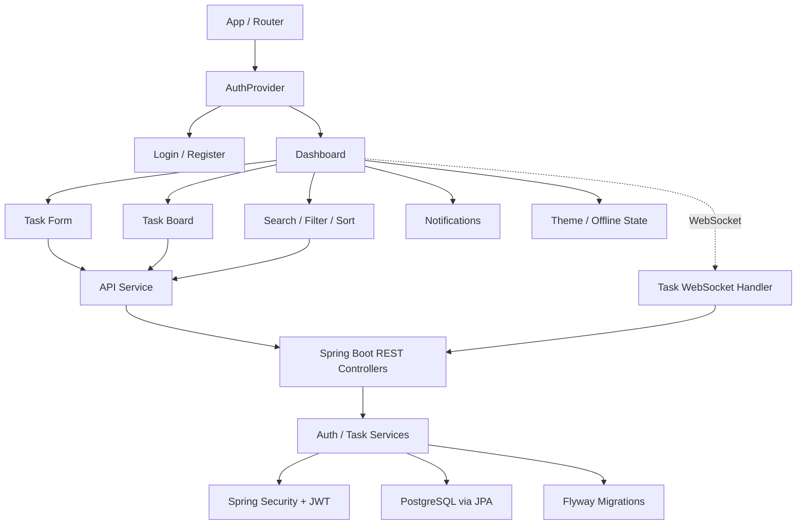

# TaskFlow — Project Documentation

## 1. Project Overview

TaskFlow is a full-stack task management application with a React + TypeScript frontend and Spring Boot REST backend.

The application provides:
- Secure registration and login
- JWT access tokens with rotating refresh tokens
- PostgreSQL persistence with Flyway migrations
- CRUD task management
- Kanban drag-and-drop workflow
- Priority, due dates, categories and assignment
- Search, filtering and sorting
- WebSocket-based live refresh events
- Offline cached task viewing
- Dark/light theme
- Browser notification permission support
- Role-based authorization
- Global validation/error handling
- Swagger/OpenAPI documentation
- Docker and Docker Compose support
- GitHub Actions CI

## 2. Live Links

Frontend: https://week8-fullstack-task-manager.onrender.com

Backend API: https://taskflow-backend-3j3q.onrender.com

Swagger UI: https://taskflow-backend-3j3q.onrender.com/swagger-ui.html

GitHub: https://github.com/Ashutosh9-pan/week8-fullstack-task-manager

## 3. Technical Architecture

React + TypeScript handles the UI, routing, form validation and task board.

Spring Boot handles:
- REST controllers
- authentication
- authorization
- task services
- persistence
- refresh tokens
- WebSocket events
- API documentation
- health and observability

PostgreSQL stores users, tasks and refresh tokens.

Flyway manages schema changes using versioned migrations.

## 4. Component Hierarchy & Data Flow

**Data flow:** The React UI uses the shared authentication context and API service to call protected Spring Boot REST endpoints. The backend validates JWTs, applies role/task access rules, persists data through JPA/PostgreSQL, and broadcasts task-change events through WebSocket. The dashboard reacts to those events by refreshing authenticated task data.

## 5. Authentication

### Registration
1. User submits name, email and password.
2. Bean validation checks the request.
3. Password is hashed using BCrypt.
4. User is stored with the USER role.
5. Access JWT and refresh token are issued.

### Login
1. Credentials are validated against the stored BCrypt hash.
2. A new access JWT and refresh token are issued.
3. The frontend stores the session locally.

### Refresh
The frontend automatically requests /api/auth/refresh after an expired/invalid access token response when a refresh token is available. The old refresh token is revoked and a new access/refresh pair is issued.

### Logout
The refresh token is revoked on the server and local session data is cleared.

## 5. Task Management

Each task supports:
- title
- description
- status
- priority
- due date
- position
- category
- assignee email
- creation/update timestamps

Statuses:
- TODO
- IN_PROGRESS
- DONE

Priorities:
- LOW
- MEDIUM
- HIGH

The task service limits normal users to owned tasks plus tasks explicitly assigned to their email.

## 6. Search, Filtering and Sorting

The backend supports:
- q — title/description search
- status — status filter
- priority — priority filter
- sort — position, due, priority, created, title

The frontend also provides interactive search, filter and sort controls for the task board.

## 7. Drag-and-Drop

Tasks are draggable cards on a three-column Kanban board.

Dropping a task into another status column updates the task's status through the REST API and refreshes the board.

## 8. Real-Time Updates

A native WebSocket endpoint is available at:

/ws/tasks

Task creation, update and deletion broadcast generic change events. Connected clients use the event to reload their authenticated task data.

Because the event contains no private task payload, each browser still obtains task details through its authenticated REST request.

## 9. Due Reminders and Notifications

Tasks with due dates are classified as:
- overdue
- due within 24 hours
- upcoming

The dashboard displays due reminders in a notification panel and provides a browser notification permission control.

## 10. Offline Support

The last successfully loaded task list is cached in localStorage.

When the network is unavailable:
- the application indicates offline state
- cached tasks remain visible
- write actions are disabled until a connection is available

A service worker is registered to cache the application shell for offline loading.

## 11. Security

Implemented controls include:
- BCrypt password hashing
- JWT authentication
- rotating refresh tokens
- role-based authorization
- CORS configuration
- request validation
- global exception handling
- authentication rate limiting
- correlation IDs
- JPA repository queries
- React escaped rendering

Sensitive configuration is excluded from Git and supplied through environment variables in production.

## 12. Role-Based Access

Users are assigned one of:
- USER
- ADMIN

The ADMIN role is required for:

GET /api/admin/users

The normal task API remains authenticated for all logged-in users.

## 13. API Documentation

Swagger UI is exposed at:

https://taskflow-backend-3j3q.onrender.com/swagger-ui.html

OpenAPI JSON is available at:

/v3/api-docs

The API documents authentication and task endpoints.

## 14. Database Migrations

V1 — Initial tasks table

V2 — Users table

V3 — Task-to-user relationship

V4 — Task status, priority, due date, position, category and assignee

V5 — Refresh tokens

V6 — User roles

## 15. Observability

Spring Boot Actuator provides the health endpoint:

/actuator/health

A correlation ID filter adds X-Correlation-Id to API responses and places it into the logging MDC for request tracing.

## 16. Frontend Engineering

The frontend uses:
- React 19
- TypeScript
- React Router
- Context API
- React Hook Form
- Tailwind CSS utility layer
- native WebSocket API
- custom responsive CSS
- error boundary
- local storage caching

Keyboard shortcuts:
- N — focus task title
- / — focus search
- Esc — close reminders

## 17. Docker

Docker support includes:
- multi-stage Spring Boot backend image
- Nginx frontend image
- PostgreSQL development container
- Docker Compose orchestration
- SPA fallback configuration

Run the full local stack with:

docker compose up --build

## 18. Testing and CI

Backend tests include:
- JUnit and Mockito unit tests for AuthService and TaskService
- Spring Boot integration tests for authentication and security
- RestAssured HTTP API tests for health and protected endpoints
- Testcontainers PostgreSQL migration test covering all Flyway migrations
- H2-backed integration tests for fast application-context coverage

Frontend tests include:
- Vitest component and service tests
- React Testing Library rendering/integration coverage
- MSW request interception for API mock testing
- axe-core automated accessibility checks
- Cypress browser E2E coverage for authentication navigation and validation
- TypeScript typecheck
- production build

GitHub Actions runs backend tests plus frontend lint, typecheck, unit tests, build, and Cypress E2E tests on pushes and pull requests to main.

## 19. Screenshots

The repository includes screenshots for login, registration, dashboard, task states, filters, actions and editing under:

docs/screenshots/

## 20. Requirements Traceability

| Requirement Area | Implementation |
|---|---|
| React frontend | React + TypeScript |
| REST backend | Spring Boot controllers/services |
| JWT auth | Access token + refresh token |
| Refresh tokens | Refresh token entity/service/endpoints |
| CRUD | Task create/read/update/delete |
| PostgreSQL | JPA + PostgreSQL |
| Flyway | V1 through V6 migrations |
| WebSocket | /ws/tasks |
| Drag and drop | Kanban task board |
| Search | title/description search |
| Filters | status and priority |
| Sorting | position/due/priority/created/title |
| Due reminders | dashboard notification panel |
| Assignment | assignee email + access |
| Role-based access | USER / ADMIN |
| Error handling | validation + global exception handler |
| Rate limiting | authentication limiter |
| Swagger | springdoc Swagger UI |
| Health checks | Spring Boot Actuator |
| Observability | correlation IDs |
| Offline support | cache + service worker |
| PWA | manifest + service worker |
| Form validation | React Hook Form |
| Context API | AuthProvider |
| Error boundary | ErrorBoundary component |
| Dark/light theme | dashboard theme toggle |
| Responsive UI | mobile/tablet layouts |
| Docker | Dockerfiles + Compose |
| CI | GitHub Actions |
| Frontend tests | Vitest + RTL |

## 21. Conclusion

TaskFlow demonstrates end-to-end full-stack development across frontend, backend, authentication, database migrations, API design, real-time communication, security, testing, containerization and deployment.
